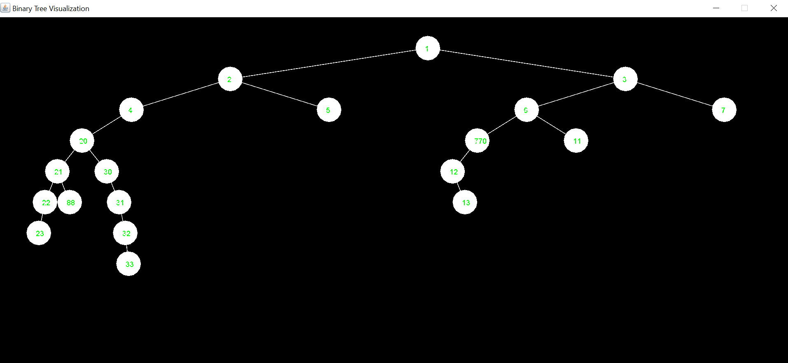

# BinTreeVisual
GUI visualisation of Bin Tree

______________________________________________

# About
The purpose of this code is to display any class that represents the idea of a Binary Tree.
So, for example, if the class that represents the Binary Tree is named like whatever you, 
for example, BinNode, BinTree, etc. and has functions that returns the node's value,
left and right children of the node, like getData, getValue, getInfo, getRight, getLeft, etc.
The result should be that it will be displayed in a window with GUI.
The data is generic.
It means that the nodes of the Binary Tree can be every type or class.

______________________________________________
# Contributing
Contributing is welcome!
If you find any bug, or have any ideas for improvements, please fork,
and pull-request!
